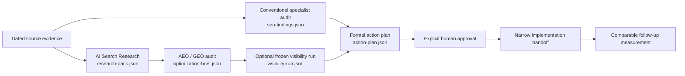

<table>
  <tr>
    <td width="136" valign="middle">
      
    </td>
    <td valign="middle">
      <h1>SEO-AEO-GEO Ultimate</h1>
      <p><strong>Evidence-first SEO, AEO, GEO, and AI-search operations for Codex.</strong></p>
      <p>Research what is true. Keep observations reviewable. Turn approved findings into safe, measurable work.</p>
    </td>
  </tr>
</table>

[](https://github.com/oegeyilmaz9/seo-aeo-geo-ultimate/actions/workflows/validate.yml)
[](LICENSE)
[](#skill-map)
[](#verify-a-checkout)

SEO-AEO-GEO Ultimate is a production-minded suite of 19 Codex skills for conventional SEO, answer-engine optimization (AEO), generative-engine optimization (GEO), and AI-search measurement. It is designed for teams that need an auditable path from source evidence to an approved change—not a universal score, a black-box “AI readiness” claim, or a promise of visibility.

## What it is built to do

- Research engine-, locale-, audience-, and surface-specific questions with dated provenance.
- Audit direct-answer completeness, entity/source consistency, technical delivery, content, structured data, international targeting, media, sitemaps, scaled pages, and comparison pages.
- Keep observed mentions, citations, answer accuracy, referrals, access gaps, and drift as separate measures with explicit definitions.
- Create formal action plans with owners, approvals, verification, guardrails, and rollback paths.
- Produce implementation-ready content and technical proposals only after the user has explicitly authorized the work.

It deliberately does **not** promise ranking, indexing, retrieval, citation, traffic, revenue, or conversion. It does not make `llms.txt`, special AI markup, fixed passage lengths, keyword density, blanket crawler rules, or a composite “SEO score” a default.

## The operating system



Each arrow is a gate, not a suggestion. A downstream skill cannot silently repair missing upstream evidence, approve its own change, or convert an observational correlation into a causal conclusion.

## Skill map

| Lane | Skills | What they own |
| --- | --- | --- |
| Coordination | `seo`, `seo-audit`, `seo-page`, `seo-plan`, `seo-action-plan`, `optimise-seo` | Routing, bounded audits, roadmaps, formal plans, and explicitly authorized implementation. |
| Research and AI search | `seo-research`, `ai-search-research`, `seo-aeo`, `seo-geo`, `ai-visibility-monitor` | Query/evidence provenance, direct-answer review, generative-engine evidence, and frozen longitudinal measurement. |
| Specialist SEO | `seo-content`, `seo-technical`, `seo-schema`, `seo-hreflang`, `seo-sitemap`, `seo-images` | Content, delivery, structured data, internationalization, sitemap, and media observations or implementation proposals. |
| Scaled and comparative work | `seo-programmatic`, `seo-competitor-pages` | Scaled-page quality controls and fair, evidence-bound comparison planning. |

### Formal artifact contracts

| Artifact | Created by | Why it exists | Validator |
| --- | --- | --- | --- |
| `research-pack.json` | `ai-search-research` | Immutable, locale-aware evidence and ground truth for AI-search work. | `validate_ai_search_research.py validate-pack` |
| `optimization-brief.json` | `seo-aeo` or `seo-geo` | Evidence-linked AEO/GEO findings, recommendations, and experiments. | `validate_seo_aeo.py` or `validate_seo_geo.py` |
| `seo-findings.json` | Conventional specialist skills | Cross-team, raw-evidence-backed SEO observations. | `validate_seo_findings.py validate-findings` |
| `visibility-run.json` | `ai-visibility-monitor` | A frozen, hash-pinned observational measurement run. | `validate_ai_visibility_monitor.py validate-run` |
| `action-plan.json` | `seo-action-plan` | Approved-scope work with ownership, verification, and rollback. | `validate_seo_action_plan.py validate-plan` |

Read [the SEO Findings protocol](docs/SEO-FINDINGS-PROTOCOL.md) for the conventional SEO handoff shape. The AEO/GEO protocol lives with each specialist skill and is intentionally distinct from the general findings artifact.

## Quick start

### 1. Clone and verify the suite

Requires Python 3.11+; the continuous checks run on Python 3.11 and 3.13.

```powershell
git clone https://github.com/oegeyilmaz9/seo-aeo-geo-ultimate.git
Set-Location seo-aeo-geo-ultimate

python scripts/sync_contracts.py --check
python scripts/validate_source_registry.py docs/research/2026-08-06-source-registry.json --as-of 2026-08-06
python scripts/validate_suite.py --as-of 2026-08-06
python scripts/run_tests.py
```

The source registry is deliberately freshness-gated. For a later release, re-check the primary sources and replace the review date with the actual release date—do not freeze an expired registry just to make validation pass.

### 2. Install skill instructions into Codex

The repository remains the source of validators, schemas, source registry, and tests. Runtime installation deploys only the self-contained skill instruction trees.

```powershell
# See exactly what would change first.
python scripts/install_runtime.py --dry-run

# Install all 19 skills. Existing target folders are moved to a timestamped backup.
python scripts/install_runtime.py

# Or replace selected skills only.
python scripts/install_runtime.py --skills seo seo-action-plan seo-content
```

By default, skills install to `~/.codex/skills`; backups and install manifests go to `~/.codex/seo-skill-suite-state`. The installer rejects reparse points, source/runtime/state overlaps, and non-directory existing targets; it stages copies and verifies a tree hash before completing the replacement.

### 3. Start a real workflow in Codex

| Need | Start with | Expected next handoff |
| --- | --- | --- |
| A broad SEO request | `$seo` | Routes work to the smallest appropriate lane. |
| Search intent, audience, keywords, or competitor questions | `$seo-research` | `seo-findings.json` when a formal cross-team finding is needed. |
| Engine/surface-specific AI-search evidence | `$ai-search-research` | Validated `research-pack.json`. |
| Direct-answer/extractability review | `$seo-aeo` | Validated AEO `optimization-brief.json`. |
| Entity, source, citation, or documented generative-search controls | `$seo-geo` | Validated GEO `optimization-brief.json`. |
| Repeated mentions, citations, answer accuracy, referrals, or drift | `$ai-visibility-monitor` | Validated `visibility-run.json`, with no causal claim. |
| Conventional technical/content/schema/international work | The relevant specialist skill | Validated `seo-findings.json` plus raw evidence. |
| Multi-owner implementation plan | `$seo-action-plan` | A formal plan awaiting required approvals. |
| Authorized code/content change | `$optimise-seo` | Narrow change, verification, and rollback record. |

## Working with evidence

The suite uses four evidence classes: `confirmed`, `vendor-recommended`, `experimental`, and `speculative`. A recommendation inherits the weakest evidence premise it depends on. Experimental evidence can form an experiment; speculative evidence cannot be laundered into an implementation claim.

Raw captures are stored only in the work bundle that requires them. Published examples use generic fixtures. The public repository intentionally excludes customer data, private URLs, credentials, live analytics exports, historical captures, and copied protected content.

For AI-search work, a `research-pack.json` records locale, engines, surfaces, entities, questions, raw evidence references, facts, gaps, and dates. A visibility run pins its research pack, frozen query corpus, raw answers/access receipts, and any referral export by hash. This makes a later comparison inspectable instead of merely persuasive.

## Safe implementation boundary

`seo-action-plan` creates a plan; it does not implement the change. `optimise-seo` can act only when implementation is explicitly authorized and the action has a defined owner, approval, acceptance criteria, verification method, guardrail, and rollback. High-risk crawler, indexation, canonical, WAF, or transport changes require a narrower test and rollback path.

This boundary is intentional: a valid artifact proves integrity and traceability. It does not itself approve publication or establish an outcome.

## Verification and continuous integration

Every pull request and push to `main` runs:

```text
1. Generated-contract byte and hash check
2. Suite structure and source-freshness validation
3. Isolated regression tests on Python 3.11 and 3.13
```

The evaluation suite includes normal flows, schema combinators, contract-copy integrity, malformed JSON, artifact-boundary escape attempts, reparse-point handling, action-plan evidence disconnection, causal-language rejection, and installer safety checks.

## Source discipline

Design decisions are recorded in the [source registry](docs/research/2026-08-06-source-registry.json) and [platform/market review](docs/research/2026-08-06-platform-and-market-review.md). The suite prefers current primary documentation and standards; market tools are used only as clearly labelled product-pattern context. Vendor guidance is never converted into a universal factor or guarantee.

## Contributing

Read [CONTRIBUTING.md](CONTRIBUTING.md) before opening a pull request. In short: preserve evidence boundaries, add abuse/negative tests with new invariants, refresh sources honestly, sync contract copies, and keep unrelated changes out of the same PR.

For release checks, use [docs/RELEASE-CHECKLIST.md](docs/RELEASE-CHECKLIST.md). Security guidance is in [SECURITY.md](SECURITY.md).

## License

Licensed under the [Apache License 2.0](LICENSE). See [NOTICE](NOTICE) for attribution and repository identity.
