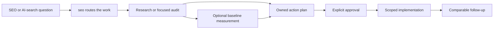

<table>
  <tr>
    <td width="136" valign="middle">
      
    </td>
    <td valign="middle">
      <h1>SEO-AEO-GEO Ultimate</h1>
      <p><strong>A complete, evidence-first SEO, AEO, GEO, and AI-search skill suite for Codex and Claude Code.</strong></p>
      <p>Start with one router. Move from a real question to focused research, a reviewable finding, a measurable plan, and an approved change.</p>
    </td>
  </tr>
</table>

[](https://github.com/oegeyilmaz9/seo-aeo-geo-ultimate/actions/workflows/validate.yml)
[](LICENSE)
[](#what-is-inside)
[](#install-on-codex)
[](#install-on-claude-code)

## One request. The right workflow.

SEO work rarely arrives neatly labelled. “Why are we absent from AI answers?” may need source research, a prompt corpus, or repeated surface observations. “Improve this site” may need content, architecture, technical, commerce, local, video, or authority work. SEO-AEO-GEO Ultimate starts from one router, finds the smallest useful lane, and keeps evidence, ownership, approval, and follow-up connected.

| Instead of | You get |
| --- | --- |
| Choosing a specialist before you know what the job really is | One router that sends the request to the smallest useful workflow |
| Treating technical SEO, answer readiness, entity evidence, commerce, local, and measurement as one vague task | A clear scope, evidence standard, owner, and next handoff for each lane |
| Shipping a tactic because it sounds current | A decision trail with verification and rollback when risk calls for it |
| Calling a later mention, citation, or traffic shift proof | A comparable observation with its limits stated clearly |

The result is a practical operating system for search and AI visibility: broad enough for a serious site, structured enough for a team to review, and modular enough to use one skill at a time.

[Install on Codex](#install-on-codex) · [Install on Claude Code](#install-on-claude-code) · [Start with the router](#start-with-the-router) · [Submit to the Claude directory](docs/CLAUDE-PLUGIN-SUBMISSION.md)

## Start with the router

You do not need to memorize the internal map. Start with the `seo` router and name the outcome you want.

| Runtime | Router invocation |
| --- | --- |
| Codex | `$seo` |
| Claude Code plugin | `/seo-aeo-geo-ultimate:seo` |

```text
Audit our Turkish pricing page and tell us what to fix first.
Make our documentation ready for AI search.
Create and validate a maintained llms.txt from our public documentation.
Find out why our brand is absent from a specific AI-search surface.
Turn these validated findings into an approval-ready implementation plan.
```

The router is not a generic audit that tries to do everything itself. It reads the request, picks the right specialist, and keeps the handoff clear. Direct specialist calls remain available when you already know the exact lane.

| You ask for | The router starts with |
| --- | --- |
| Search intent, competitors, or audience questions | `seo-research` |
| Engine or surface-specific AI-search evidence | `ai-search-research` |
| Direct-answer clarity and extractability | `seo-aeo` |
| Entity, source, citation, or documented engine controls | `seo-geo` |
| Search Console clicks, impressions, CTR, or query/page change | `seo-performance` |
| Repeated AI answers, mentions, sources, citations, referrals, or drift | `ai-visibility-monitor` |
| Site hierarchy, crawl paths, internal links, depth, or orphan pages | `seo-architecture` |
| Products, merchants, local presence, video, news, or Discover | The matching vertical specialist |
| Agent-readable journeys, delegated actions, or commerce protocols | `seo-agentic` |
| Crawlability, rendering, schema, sitemaps, images, hreflang, or a maintained `llms.txt` | The matching technical specialist |
| A multi-owner plan or scoped authorized change | `seo-action-plan`, then the exact implementation owner |

## Install on Codex

Requires Python 3.11 or later.

```powershell
git clone https://github.com/oegeyilmaz9/seo-aeo-geo-ultimate.git
Set-Location seo-aeo-geo-ultimate

# Check the suite before installing it.
python scripts/sync_contracts.py --check
python scripts/validate_suite.py
python scripts/validate_claude_plugin.py
python scripts/run_tests.py
```

Install the shared skills into Codex after the checks pass:

```powershell
# Preview the runtime changes first.
python scripts/install_runtime.py --dry-run

# Install all 27 skills. Existing target folders are backed up.
python scripts/install_runtime.py

# Confirm the support package, runtime locators, and installed skill hashes.
python scripts/install_runtime.py --verify
```

The installer copies the skill trees and an immutable support package containing validators, schemas, manifests, and required documentation. By default skills go to `~/.codex/skills`; versioned support packages, backups, and install state go to `~/.codex/seo-skill-suite-state`. A `.seo-suite-runtime.json` locator beside each installed `SKILL.md` resolves the active package through `current.json`, so the repository clone does not need to be retained after installation.

Start a new Codex task after installation so skill discovery and the runtime locator refresh, then invoke `$seo Audit ...` or any named specialist.

## Install on Claude Code

This repository is both a Claude Code plugin and a small developer marketplace. The plugin contains the same 27 skill trees used by Codex; there is no forked or reduced Claude edition.

### Install from this repository

Run these commands inside Claude Code:

```text
/plugin marketplace add oegeyilmaz9/seo-aeo-geo-ultimate
/plugin install seo-aeo-geo-ultimate@oegeyilmaz9-skills
/reload-plugins
```

Then use the router:

```text
/seo-aeo-geo-ultimate:seo Audit our Turkish pricing page and tell us what to fix first.
```

Plugin skills are namespaced by Claude Code, so `/seo-aeo-geo-ultimate:seo` is the stable Claude entry point. You can use any specialist in the same namespace, such as `/seo-aeo-geo-ultimate:seo-technical`.

Formal validators ship inside the plugin. Claude Code substitutes `${CLAUDE_PLUGIN_ROOT}` in skill content with the installed plugin path, so users do not need a separate repository clone just to run those checks.

The Markdown skills can still guide an audit without Python. Formal schema, hash, and bundle validation requires Python 3.11 or later; when Python is unavailable, treat the artifact handoff as provisional until the validator runs successfully.

### Install from the official Claude plugin directory

After Anthropic approves this repository's directory submission, the plugin becomes available through Claude Code's automatically configured `claude-plugins-official` marketplace:

```text
/plugin install seo-aeo-geo-ultimate@claude-plugins-official
```

If an existing Claude Code installation cannot find the listing, refresh it with `/plugin marketplace update claude-plugins-official`. Only installations missing the official marketplace need `/plugin marketplace add anthropics/claude-plugins-official` first. The direct repository marketplace flow above remains available independently of directory approval.

For a local development session, Claude Code can load the clone directly with `claude --plugin-dir .`.

## One source, two runtimes

The package deliberately shares one `skills/` tree across both runtimes.

| Shared | Platform-specific |
| --- | --- |
| 27 `SKILL.md` workflows, contracts, references, safeguards, names, and routing rules | Codex uses `agents/openai.yaml` metadata and `$seo` entry syntax |
| Evidence and artifact validation | Claude Code uses `.claude-plugin/plugin.json`, marketplace metadata, and `/seo-aeo-geo-ultimate:seo` |
| Every update published from this repository | Runtime installation commands and UI presentation |

Claude Code auto-discovers the skill folders at the plugin root. The package declares no MCP servers, hooks, background monitors, credentials, telemetry, or automatic network actions.

## From question to approved change



Not every request needs every phase. The suite prevents a research task from silently becoming a production change and prevents a metric from being dressed up as a causal promise.

## What is inside

SEO-AEO-GEO Ultimate contains 27 focused agent skills. They share contracts where a handoff benefits from structure and stay separate where the work is meaningfully different.

| Area | Skills | What they help you do |
| --- | --- | --- |
| Route and coordinate | `seo` (the router), `seo-audit`, `seo-page`, `seo-plan`, `seo-action-plan`, `optimise-seo` | Start anywhere, scope the work, create an owned plan, and prepare an authorized change. |
| Research and measurement | `seo-research`, `ai-search-research`, `seo-performance`, `ai-visibility-monitor` | Build a formal query corpus and measure conventional search and AI surfaces with distinct, comparable runs. |
| Answer and entity readiness | `seo-aeo`, `seo-geo`, `seo-authority` | Improve answer clarity, entity evidence, claim support, source quality, and authority signals. |
| Technical and architecture | `seo-technical`, `seo-architecture`, `seo-schema`, `seo-hreflang`, `seo-sitemap`, `seo-images` | Review crawl, rendering, site graph, structured data, international, sitemap, image systems, and optional `llms.txt` publisher guides. |
| Content and vertical search | `seo-content`, `seo-commerce`, `seo-local`, `seo-video`, `seo-news-discover`, `seo-agentic` | Work on editorial quality, product discovery, local presence, media discovery, timely publishing, and agent-readable journeys. |
| Scaled and comparison work | `seo-programmatic`, `seo-competitor-pages` | Plan scaled page systems and fair comparison pages with evidence in view. |

### Handoffs that keep work moving

| Artifact | Created by | What it gives the next owner |
| --- | --- | --- |
| `research-pack.json` | `ai-search-research` | Dated, locale-aware evidence and ground truth for AI-search work. |
| `query-corpus.json` | `seo-research` or `ai-search-research` | A versioned distinction between user needs, observed queries, AI prompts, and executed subqueries. |
| `optimization-brief.json` | `seo-aeo` or `seo-geo` | Evidence-linked AEO/GEO findings, recommendations, and experiments. |
| `seo-findings.json` | Conventional specialist skills | Raw-evidence-backed SEO findings ready for a cross-team handoff. |
| `seo-performance-run.json` | `seo-performance` | A hash-pinned conventional search baseline or comparison with query and privacy limitations. |
| `visibility-run.json` | `ai-visibility-monitor` | A repeat-aware AI-surface observation run with access state, consulted sources, visible citations, and confidence. |
| `site-graph.json` | `seo-architecture` | A bounded map of pages and links with capture evidence and completeness limits. |
| `platform-controls.json` | `seo-technical` | Dated feature lifecycle, crawler-purpose, notification, and protocol decisions. |
| `llms.txt` | `seo-technical` | An optional, validated map of canonical public resources for clients that choose to consume it. |
| `action-plan.json` | `seo-action-plan` | Approval-ready scope, ownership, verification, and rollback for a proposed change; formal status starts as pending. |

Read the [SEO Findings](docs/SEO-FINDINGS-PROTOCOL.md), [Query Corpus](docs/QUERY-CORPUS-PROTOCOL.md), [SEO Performance](docs/SEO-PERFORMANCE-PROTOCOL.md), [Site Graph](docs/SITE-GRAPH-PROTOCOL.md), [Platform Controls](docs/PLATFORM-CONTROLS.md), and [`llms.txt` publisher-guide](skills/seo-technical/references/llms-txt-protocol.md) protocols. AEO and GEO retain their own audit contract because answer readiness and entity/citation readiness are different jobs.

## Practical artifact and data tools

The skills can work in Markdown alone, while the repository tools make formal handoffs easier to start, validate, migrate, and review. They use Python 3.11+, require no paid API, and keep draft or imported data clearly separate from validated artifacts.

```powershell
# See every artifact contract, then create an explicitly unvalidated draft bundle.
python scripts/init_artifact.py list
python scripts/init_artifact.py bundle conventional --out work/example --seed example-project --created-at 2026-08-10T00:00:00Z

# Review supported safe migrations. The source artifact is never modified.
python scripts/migrate_artifact.py paths

# Render a readable report only after the artifact's semantic validator passes.
python scripts/render_artifact_report.py examples/conventional-seo-handoff/seo-findings.json --bundle examples/conventional-seo-handoff --out work/seo-findings-report.md

# Normalize an authorized Search Console export without inventing metrics.
python scripts/import_seo_exports.py gsc-csv exports/gsc.csv --output work/gsc-source.json --property sc-domain:example.com --window-start 2026-07-01T00:00:00Z --window-end 2026-08-01T00:00:00Z
```

Import adapters also cover Bing Webmaster Tools CSV, organic GA4 CSV, crawler CSV, and Apache/Nginx access logs. Read [Data Import Adapters](docs/DATA-IMPORT-ADAPTERS.md) for accepted fields, provenance, privacy boundaries, and exact commands. The [validated example bundles](examples/README.md) show conventional SEO and AI-search handoffs end to end.

## Built for useful, defensible work

The suite helps teams make stronger decisions and learn from what happens after a change. Recommendations carry an evidence class. Important changes can include approval, verification, monitoring, and rollback. Search performance and AI visibility are measured separately, so each result keeps the context needed for a meaningful comparison.

The workflows support ambitious search and AI-discovery programs while keeping claims grounded in observable evidence. The suite can create `/llms.txt` as a low-cost future-readiness layer when canonical public sources and a maintenance owner exist; it validates the file without presenting it as a ranking requirement. Primary-source discipline and safety checks are built in; see the [source registry](docs/research/2026-08-06-source-registry.json), [platform and market review](docs/research/2026-08-06-platform-and-market-review.md), and [release checklist](docs/RELEASE-CHECKLIST.md). As with any search program, platforms decide ranking, indexing, retrieval, and presentation outcomes.

## Claude directory submission

The public repository includes the Claude plugin manifest, a developer marketplace catalog, an offline compatibility validator, and ready-to-paste listing/security copy. The maintainer can submit the repository URL through the Claude.ai or Claude Console form.

Read [Claude Plugin Submission](docs/CLAUDE-PLUGIN-SUBMISSION.md) for the exact account path and copy. Anthropic’s review is independent; listing is not guaranteed.

## Community

Use [GitHub Discussions](https://github.com/oegeyilmaz9/seo-aeo-geo-ultimate/discussions) for setup questions, workflow ideas, and routing feedback. Use issue forms for reproducible bugs or scoped improvements. Read [SUPPORT.md](SUPPORT.md), [CONTRIBUTING.md](CONTRIBUTING.md), and [SECURITY.md](SECURITY.md) before contributing or reporting a vulnerability.

## Verify a checkout

Every push and pull request runs the checks below. A weekly scheduled run repeats the full suite so dated source and platform-control freshness failures surface even when the repository receives no commits. A failed scheduled run opens or updates one deduplicated review issue; the next passing scheduled run closes it.

```text
1. Generated-contract byte and hash check
2. Suite structure and source-freshness validation
3. Claude plugin and marketplace structural validation
4. Isolated regression tests on Python 3.11
```

The evaluation suite covers contracts, source validation, query provenance, measurement arithmetic, repeat-aware AI observations, site graphs, platform-control freshness, operational recovery and experiment recipes, specialist behavior boundaries, artifact boundaries, action-plan evidence disconnection, installer safety, and Claude package metadata. Read [CONTRIBUTING.md](CONTRIBUTING.md) before changing the suite.

## License

Released under the [Apache License 2.0](LICENSE). See [NOTICE](NOTICE) for attribution and repository identity.

If you reference this project in a report, article, or implementation, GitHub can generate a citation from [CITATION.cff](CITATION.cff).
