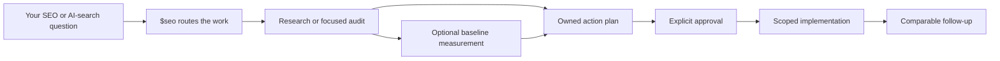

<table>
  <tr>
    <td width="136" valign="middle">
      
    </td>
    <td valign="middle">
      <h1>SEO-AEO-GEO Ultimate</h1>
      <p><strong>One Codex front door for SEO, AEO, GEO, and AI-search work.</strong></p>
      <p>Turn “what should we do?” into the right research, audit, plan, or approved change.</p>
    </td>
  </tr>
</table>

[](https://github.com/oegeyilmaz9/seo-aeo-geo-ultimate/actions/workflows/validate.yml)
[](LICENSE)
[](#what-is-inside)
[](#verify-a-checkout)

## Stop collecting AI-search tactics. Start with the next right move.

An SEO request can sound small and still hide five different jobs. “Why are we not cited?” might need source research. “Make our documentation ready for AI search” might need a technical review. “Fix our visibility” might need an audit, a baseline, an approved plan, and only then a change.

SEO-AEO-GEO Ultimate gives Codex one place to start: `$seo`, the SEO Router. It reads the job, chooses the smallest useful specialist lane, and keeps research, measurement, approval, and implementation connected. You get work your team can review and move forward, not a pile of generic advice.

[Install the suite](#install) · [Run your first request](#start-here) · [See what is inside](#what-is-inside)

## What changes for your team

| Instead of | You get |
| --- | --- |
| Choosing between a dozen SEO skills before you can start | One `$seo` entry point that routes every request to the right lane |
| Treating AEO, GEO, technical SEO, and measurement as the same task | A clear owner, evidence standard, and next handoff for each job |
| Shipping a tactic because it sounds current | A documented decision, scope, verification method, and rollback path when the change carries risk |
| Calling a later traffic or citation change proof | A measurable comparison with its limits stated clearly |

This suite is for Codex users who want to turn SEO and AI-search work into a repeatable operating rhythm: investigate the right question, make a focused decision, and hand the next owner what they need.

## Start here

Use `$seo`, the SEO Router, for every request. You do not need to know the internal skill map first.

```text
$seo Audit our Turkish pricing page and tell us what to fix first.
$seo Make our documentation ready for AI search.
$seo Find out why our brand is absent from a specific AI-search surface.
$seo Turn these validated findings into an approved implementation plan.
```

### `$seo` is the SEO Router

`$seo` is the command your team uses; it is not a generic audit that tries to do every job itself. It reads the request, picks the right specialist, and keeps the handoff clear. A straightforward technical issue can go straight to `seo-technical`; a broader AI-search question can begin with research, then move into the right audit and implementation path.

The router handles a narrow request without inflating it into a full audit. When the work crosses lanes, it keeps the sequence straight.

| You ask | `$seo` starts with |
| --- | --- |
| Search intent, competitors, or audience questions | `seo-research` |
| Engine or surface-specific AI-search evidence | `ai-search-research` |
| Direct-answer clarity and extractability | `seo-aeo` |
| Entity, source, citation, or documented engine controls | `seo-geo` |
| Crawlability, rendering, schema, sitemaps, images, or hreflang | The matching specialist skill |
| Repeated mentions, citations, referrals, accuracy, or drift | `ai-visibility-monitor` |
| A multi-owner plan or a scoped authorized change | `seo-action-plan`, then the exact implementation owner |

Already know the exact lane? Direct specialist calls still work. `$seo` remains the better default when you want the suite to make the call.

## From question to approved change



The point is not to make every request slower. It is to stop a research task from becoming an unreviewed production change, or a metric from becoming a sales claim.

## What is inside

SEO-AEO-GEO Ultimate contains 19 focused Codex skills. They share contracts where a handoff needs structure and stay separate where the work is different.

| Area | Skills | What they help you do |
| --- | --- | --- |
| Route and coordinate | `seo` (the SEO Router), `seo-audit`, `seo-page`, `seo-plan`, `seo-action-plan`, `optimise-seo` | Start anywhere, scope the work, create an owned plan, and prepare an authorized change. |
| Research and AI search | `seo-research`, `ai-search-research`, `seo-aeo`, `seo-geo`, `ai-visibility-monitor` | Investigate questions, review answers and entities, and measure observed change over time. |
| Specialist SEO | `seo-content`, `seo-technical`, `seo-schema`, `seo-hreflang`, `seo-sitemap`, `seo-images` | Review and improve the content and technical surfaces that shape discovery. |
| Scaled and comparison work | `seo-programmatic`, `seo-competitor-pages` | Plan scaled page systems and fair comparison pages with evidence in view. |

### The handoffs that keep work moving

| Artifact | Created by | What it gives the next owner |
| --- | --- | --- |
| `research-pack.json` | `ai-search-research` | Dated, locale-aware evidence and ground truth for AI-search work. |
| `optimization-brief.json` | `seo-aeo` or `seo-geo` | Evidence-linked AEO/GEO findings, recommendations, and experiments. |
| `seo-findings.json` | Conventional specialist skills | Raw-evidence-backed SEO findings ready for a cross-team handoff. |
| `visibility-run.json` | `ai-visibility-monitor` | A frozen observation run for a later like-for-like comparison. |
| `action-plan.json` | `seo-action-plan` | Approved scope, ownership, verification, and rollback for a proposed change. |

Read [the SEO Findings protocol](docs/SEO-FINDINGS-PROTOCOL.md) for the conventional handoff shape. AEO and GEO use their own audit contracts because answer readiness and entity/citation readiness are not the same job.

## Install

Requires Python 3.11 or later.

```powershell
git clone https://github.com/oegeyilmaz9/seo-aeo-geo-ultimate.git
Set-Location seo-aeo-geo-ultimate

# Check the suite before installing it.
python scripts/sync_contracts.py --check
python scripts/validate_suite.py
python scripts/run_tests.py
```

Install into Codex after the checks pass:

```powershell
# Preview the runtime changes first.
python scripts/install_runtime.py --dry-run

# Install all 19 skills. Existing target folders are backed up.
python scripts/install_runtime.py
```

The repository remains the source for validators, schemas, tests, and research sources. The runtime install contains the skill instruction trees. By default, skills install to `~/.codex/skills`; backups and install manifests go to `~/.codex/seo-skill-suite-state`.

## Credible by design

The suite is built to help you make better decisions and observe what happens after a change. It does not turn a checklist into a guarantee of ranking, indexing, retrieval, citation, traffic, revenue, or conversion.

That distinction makes the work more useful. A recommendation carries its evidence class. A risky change carries a verification and rollback path. A visibility result stays an observation until there is enough evidence to say more.

Primary source discipline and safety checks are built into the suite. See the [source registry](docs/research/2026-08-06-source-registry.json), the [platform and market review](docs/research/2026-08-06-platform-and-market-review.md), and the [release checklist](docs/RELEASE-CHECKLIST.md).

## Verify a checkout

Every pull request and push to `main` runs:

```text
1. Generated-contract byte and hash check
2. Suite structure and source-freshness validation
3. Isolated regression tests on Python 3.11
```

The evaluation suite covers valid flows, malformed JSON, schema combinators, contract-copy integrity, artifact-boundary escapes, reparse-point handling, action-plan evidence disconnection, causal-language rejection, and installer safety.

Read [CONTRIBUTING.md](CONTRIBUTING.md) before changing the suite. Security guidance is in [SECURITY.md](SECURITY.md).

## License

Released under the [Apache License 2.0](LICENSE). See [NOTICE](NOTICE) for attribution and repository identity.
