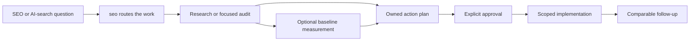

<table>
  <tr>
    <td width="136" valign="middle">
      
    </td>
    <td valign="middle">
      <h1>SEO-AEO-GEO Ultimate</h1>
      <p><strong>One front door for evidence-first SEO, AEO, GEO, and AI-search work — on Codex and Claude Code.</strong></p>
      <p>Turn “what should we do?” into the right research, audit, plan, measurement, or approved change.</p>
    </td>
  </tr>
</table>

[](https://github.com/oegeyilmaz9/seo-aeo-geo-ultimate/actions/workflows/validate.yml)
[](LICENSE)
[](#what-is-inside)
[](#install-on-codex)
[](#install-on-claude-code)

## One request. The right workflow.

SEO work rarely arrives labelled. “Why are we absent from AI answers?” might need source research. “Improve this page” might need an editorial review, technical evidence, or an approved implementation plan. SEO-AEO-GEO Ultimate starts from one router, identifies the smallest useful lane, and keeps evidence, ownership, approval, and follow-up connected.

| Instead of | You get |
| --- | --- |
| Choosing a specialist before you know what the job really is | One router that sends the request to the smallest useful workflow |
| Treating technical SEO, answer readiness, entity evidence, and measurement as one vague task | A clear scope, evidence standard, owner, and next handoff for each lane |
| Shipping a tactic because it sounds current | A decision trail with verification and rollback when risk calls for it |
| Calling a later mention, citation, or traffic shift proof | A comparable observation with its limits stated clearly |

The result is practical SEO and AI-search work your team can review, execute, and learn from — not a pile of generic recommendations.

[Install on Codex](#install-on-codex) · [Install on Claude Code](#install-on-claude-code) · [Start with the router](#start-with-the-router) · [Submit to the Claude directory](docs/CLAUDE-PLUGIN-SUBMISSION.md)

## Start with the router

You do not need to memorize the internal map. Start with the `seo` router and name the outcome you want.

| Runtime | Router invocation |
| --- | --- |
| Codex | `$seo` |
| Claude Code plugin | `/seo-aeo-geo-ultimate:seo` |

```text
Audit our Turkish pricing page and tell us what to fix first.
Make our documentation ready for AI search.
Find out why our brand is absent from a specific AI-search surface.
Turn these validated findings into an approved implementation plan.
```

The router is not a generic audit that tries to do everything itself. It reads the request, picks the right specialist, and keeps the handoff clear. Direct specialist calls remain available when you already know the exact lane.

| You ask for | The router starts with |
| --- | --- |
| Search intent, competitors, or audience questions | `seo-research` |
| Engine or surface-specific AI-search evidence | `ai-search-research` |
| Direct-answer clarity and extractability | `seo-aeo` |
| Entity, source, citation, or documented engine controls | `seo-geo` |
| Crawlability, rendering, schema, sitemaps, images, or hreflang | The matching technical specialist |
| Repeated mentions, citations, referrals, accuracy, or drift | `ai-visibility-monitor` |
| A multi-owner plan or scoped authorized change | `seo-action-plan`, then the exact implementation owner |

## Install on Codex

Requires Python 3.11 or later.

```powershell
git clone https://github.com/oegeyilmaz9/seo-aeo-geo-ultimate.git
Set-Location seo-aeo-geo-ultimate

# Check the suite before installing it.
python scripts/sync_contracts.py --check
python scripts/validate_suite.py
python scripts/validate_claude_plugin.py
python scripts/run_tests.py
```

Install the shared skills into Codex after the checks pass:

```powershell
# Preview the runtime changes first.
python scripts/install_runtime.py --dry-run

# Install all 19 skills. Existing target folders are backed up.
python scripts/install_runtime.py
```

The repository remains the source for validators, schemas, tests, and research sources. The Codex runtime install contains the skill instruction trees. By default it installs to `~/.codex/skills`; backups and install manifests go to `~/.codex/seo-skill-suite-state`.

## Install on Claude Code

This repository is both a Claude Code plugin and a small developer marketplace. The plugin contains the same 19 skill trees used by Codex; there is no forked or reduced Claude edition.

### Install from this repository

Run these commands inside Claude Code:

```text
/plugin marketplace add oegeyilmaz9/seo-aeo-geo-ultimate
/plugin install seo-aeo-geo-ultimate@oegeyilmaz9-skills
/reload-plugins
```

Then use the router:

```text
/seo-aeo-geo-ultimate:seo Audit our Turkish pricing page and tell us what to fix first.
```

Plugin skills are namespaced by Claude Code, so `/seo-aeo-geo-ultimate:seo` is the stable Claude entry point. You can use any specialist in the same namespace, such as `/seo-aeo-geo-ultimate:seo-technical`.

### Install from the Claude community marketplace

After Anthropic approves this repository’s community-directory submission, users will also be able to run:

```text
/plugin marketplace add anthropics/claude-plugins-community
/plugin install seo-aeo-geo-ultimate@claude-community
```

For a local development session, Claude Code can load the clone directly with `claude --plugin-dir .`.

## One source, two runtimes

The package deliberately shares one `skills/` tree across both runtimes.

| Shared | Platform-specific |
| --- | --- |
| 19 `SKILL.md` workflows, contracts, references, safeguards, names, and routing rules | Codex uses `agents/openai.yaml` metadata and `$seo` entry syntax |
| Evidence and artifact validation | Claude Code uses `.claude-plugin/plugin.json`, marketplace metadata, and `/seo-aeo-geo-ultimate:seo` |
| Every update published from this repository | Runtime installation commands and UI presentation |

Claude Code auto-discovers the skill folders at the plugin root. The package declares no MCP servers, hooks, background monitors, credentials, telemetry, or automatic network actions.

## From question to approved change



Not every request needs every phase. The suite prevents a research task from silently becoming a production change and prevents a metric from being dressed up as a causal promise.

## What is inside

SEO-AEO-GEO Ultimate contains 19 focused agent skills. They share contracts where a handoff needs structure and stay separate where the work is meaningfully different.

| Area | Skills | What they help you do |
| --- | --- | --- |
| Route and coordinate | `seo` (the router), `seo-audit`, `seo-page`, `seo-plan`, `seo-action-plan`, `optimise-seo` | Start anywhere, scope the work, create an owned plan, and prepare an authorized change. |
| Research and AI search | `seo-research`, `ai-search-research`, `seo-aeo`, `seo-geo`, `ai-visibility-monitor` | Investigate questions, review answers and entities, and measure observed change over time. |
| Specialist SEO | `seo-content`, `seo-technical`, `seo-schema`, `seo-hreflang`, `seo-sitemap`, `seo-images` | Review and improve the content and technical surfaces that shape discovery. |
| Scaled and comparison work | `seo-programmatic`, `seo-competitor-pages` | Plan scaled page systems and fair comparison pages with evidence in view. |

### Handoffs that keep work moving

| Artifact | Created by | What it gives the next owner |
| --- | --- | --- |
| `research-pack.json` | `ai-search-research` | Dated, locale-aware evidence and ground truth for AI-search work. |
| `optimization-brief.json` | `seo-aeo` or `seo-geo` | Evidence-linked AEO/GEO findings, recommendations, and experiments. |
| `seo-findings.json` | Conventional specialist skills | Raw-evidence-backed SEO findings ready for a cross-team handoff. |
| `visibility-run.json` | `ai-visibility-monitor` | A frozen observation run for a later like-for-like comparison. |
| `action-plan.json` | `seo-action-plan` | Approved scope, ownership, verification, and rollback for a proposed change. |

Read [the SEO Findings protocol](docs/SEO-FINDINGS-PROTOCOL.md) for the conventional handoff shape. AEO and GEO use their own audit contracts because answer readiness and entity/citation readiness are different jobs.

## Credible by design

The suite helps teams make better decisions and observe what happens after a change. It does not turn a checklist into a guarantee of ranking, indexing, retrieval, citation, traffic, revenue, or conversion.

Recommendations carry an evidence class. Risky changes carry a verification and rollback path. A visibility result stays an observation until there is enough evidence to say more. Primary-source discipline and safety checks are built in; see the [source registry](docs/research/2026-08-06-source-registry.json), [platform and market review](docs/research/2026-08-06-platform-and-market-review.md), and [release checklist](docs/RELEASE-CHECKLIST.md).

## Claude directory submission

The public repository includes the Claude plugin manifest, a developer marketplace catalog, an offline compatibility validator, and ready-to-paste listing/security copy. The maintainer only needs to submit the repository URL through the Claude Console form.

Read [Claude Plugin Submission](docs/CLAUDE-PLUGIN-SUBMISSION.md) for the exact account path and copy. Anthropic’s review is independent; listing is not guaranteed.

## Community

Use [GitHub Discussions](https://github.com/oegeyilmaz9/seo-aeo-geo-ultimate/discussions) for setup questions, workflow ideas, and routing feedback. Use issue forms for reproducible bugs or scoped improvements. Read [SUPPORT.md](SUPPORT.md), [CONTRIBUTING.md](CONTRIBUTING.md), and [SECURITY.md](SECURITY.md) before contributing or reporting a vulnerability.

## Verify a checkout

Every push and pull request runs:

```text
1. Generated-contract byte and hash check
2. Suite structure and source-freshness validation
3. Claude plugin and marketplace structural validation
4. Isolated regression tests on Python 3.11
```

The evaluation suite covers contracts, source validation, artifact boundaries, action-plan evidence disconnection, causal-language rejection, installer safety, and Claude package metadata. Read [CONTRIBUTING.md](CONTRIBUTING.md) before changing the suite.

## License

Released under the [Apache License 2.0](LICENSE). See [NOTICE](NOTICE) for attribution and repository identity.

If you reference this project in a report, article, or implementation, GitHub can generate a citation from [CITATION.cff](CITATION.cff).
